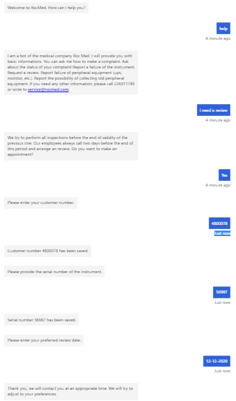

## Bot dla firmy medycznej

### Use case

Bot jest pomocą dla serwisu technicznego firmy medycznej (tutaj Roc Med). Firma medyczna produkuje sprzęt medyczny i odczynniki. Posiada swoje call center. Bot jest pierwszą linią pomocy dla klientów. Ma pomóc w odciążeniu pracowników od udzielania często zadawanych pytań. Bot również zbiera różne informacje i dane, które później mogą posłużyć pracownikom do wykonania kolejnego zadania. 

Zadania bota:

* Udzielanie odpowiedzi na pytania typu jak złożyć reklamację. --> Zapytanie użytkownika czy ma formularz reklamacji --> Jeśli użytkownik odpowie, że tak, to bot odpowiada, że według podanych wcześniej wskazówek powinien uzupełnić i wysłać formularz -- Jeśli użytkownik odpowie, że nie, to bot prosi o podanie adresu e-mail, który zapisuje i informuje użytkownika, że na ten adres e-mail zostanie wysłany odpowiedni formularz.
* Udzielenie odpowiedzi na pytania dotyczące statusu reklamacji. --> Bot zbiera od użytkownika informacje: numer klienta, datę złożenia reklamacji, adres e-mail i informuje, że na wskazany adres mejlowy zostaną przesłane informacje odnośnie tej reklamacji.
* Gdy użytkownik napisze informację, że jakiś aparat medyczny się zepsuł, bot zbiera dane: numer klienta, numer seryjny aparatu, numer telefonu i informuje, że inżynier niezwłocznie oddzwoni do klienta, również prosi o krótki opis awarii.
* Udzielenie informacji o wykonywaniu przeglądów . --> Bot informuje, że firma stara się wykonywać przeglądy na czas i zazwyczaj dwa dni przed końcem przęglądu pracownik dzwoni do kleinta umówić się na spotkanie. Bot pyta czy uzytkownik, chce ustalić konkretną datę przeglądu. --> Jeżeli użytkownik odpowie, że tak, to bot prosi o podanie numeru klienta, numeru seryjnego aparatu oraz preferowaną datę przeglądu. Bot informuje, że w odpowiednim czasie, pracownik skontaktuje się (pracownicy dzwonią do klientów według swoich list, więc bot nie musi prosić o podanie numeru telefonu) z klientem i spróbuje dostosować się do preferencji klienta. -- Jeżeli użtkownik odpowiedział, że nie chce ustalać daty przeglądu bot informuje, żeby oczekiwać telefonu.
* Instruowanie klienta co zrobić, gdy ten zgłasza zepsuty sprzęt peryferyjny (monitor, UPS itp. dołączany do aparatów medycznych). Bot odpowiada, że firma wyśle niezwłocznie nowy sprzęt. Prosi klienta o podanie modelu sprzętu, jego numeru seryjnego oraz numeru seryjnego aparatu, do którego był dołączony oraz numeru kleinta. Bot również prosi o podanie adresu i prosi o spakowanie starego sprzętu w opakowanie od nowego i powiadomienie firmy o tym, aby firma mogła odebrać ten stary sprzęt do utylizacji.
* Zbieranie informacji od klienta, gdy ten zgłasza, że można odebrać stary sprzęt peryferyjny. Klient podaje: numer seryjny sprzętu, swój numer klienta oraz adres.
* Kiedy użytkownik napisze 'help' albo poda jakieś inne hasło nie związane z powyższymi scenariuszami, bot wyświetla informacje, na jakie kategorie pytań udziela odpowiedzi.

### Kroki budowania bota

Korzystałam z serwisu LUIS i Bot Framework Composer.

#### LUIS

##### Utworzenie zasobu usług:

1. Utworzenie zasobu LUIS w Azure portal "Create a resource".
2. Nazwanie zasobu LUISMEDY.
3. Wybranie odpowiedniej subskrybcji (Azure dla studentów).
4. Utworzenie nowej grupy zasobów LearnRG.
5. Wybranie lokalizacji nabliższej mojej - west europe.
6. Wybranie darmowej opcji LUISa. 
7. Zachowanie kluczy. Klucz 1 był później potrzebny w Bot Framework Composer.

Na poniższym obrazie znajduje się okno LUISMEDY z kluczami.
 

##### Utworzenie aplikacji LUIS:

Utworzenie aplikacji w tym samym geograficznym regionie, co serwis. 
1. Zalogowanie się do LUIS https://eu.luis.ai/ jak do konta Microsoft.
2. Utworzenie aplikacji z nazwą LUISMED.
3. Utowrzenie odpowiednich zamiarów i podmiotów. Do zamiarów zależy podaj przykłady wejściowe. Podmiotami oznacza się odpowiednie wyrazy w przykładowych zdaniach z intencji.

Na poniższym obrazie znajduje się okno ze stworzonymi zamiarami.
 

Na poniższym obrazie znajduje się okno ze stworzonymi podmiotami.
 

4. Wytrenowanie i testowanie modelu LUIS.
5. Upublicznienie aplikacji.

#### Bot Framework Composer

##### Instalacja
Procedura instalacji Bot Framework Composer na Windowsie:
1. Przygotować środowisko - zainstalować .NET Core SDK 3.1 lub najnowszą wersję, pobrać z: https://dotnet.microsoft.com/download/dotnet-core/3.1.
2. Przygotowanie środowiska - zainstalować Bot Framework Emulator, pobrać z: https://github.com/microsoft/BotFramework-Emulator/releases/latest.
3. Zainstalować Bot Framework Composer, pobrać z: https://aka.ms/bf-composer-download-win.

 
 
 
 
 

* kroki budowania
* architektura
* kod + dane niezbędne do reprodukcji
początek powitanie.
2. Add new dialog
HowtoMakeComplaint 
        

### Nagranie

https://youtu.be/ZeJjKcqm0G8

Nagranie jest to DEMO mojego bota, które obrazuje środowisko Bot Framework Composer i przykładowy dialog zadziałania. W tym, krótkim filmie zostały wymienione najważniejsze elementy bota. Pokazałam scenariusz rozwiązania problemu przez bota. Klient zapytał jak złożyć reklamację i poprosił o odebranie starego UPSa. 

### Podsumowanie
