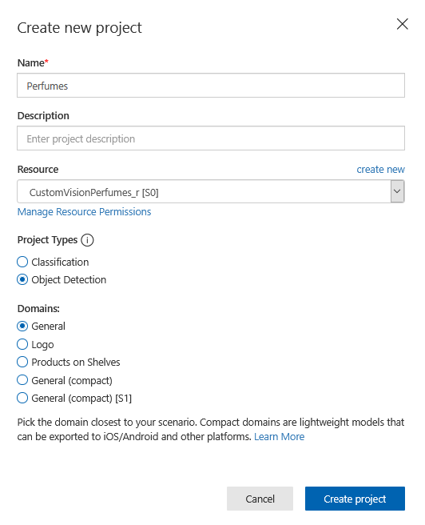
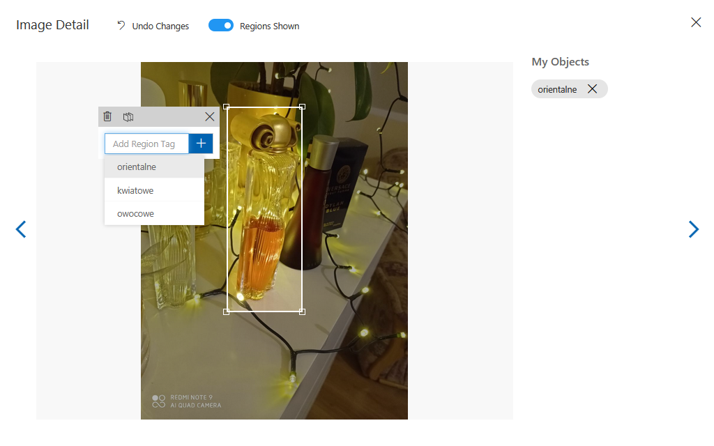
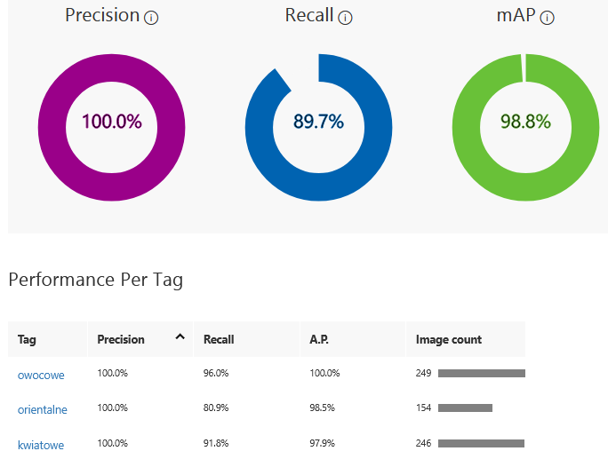
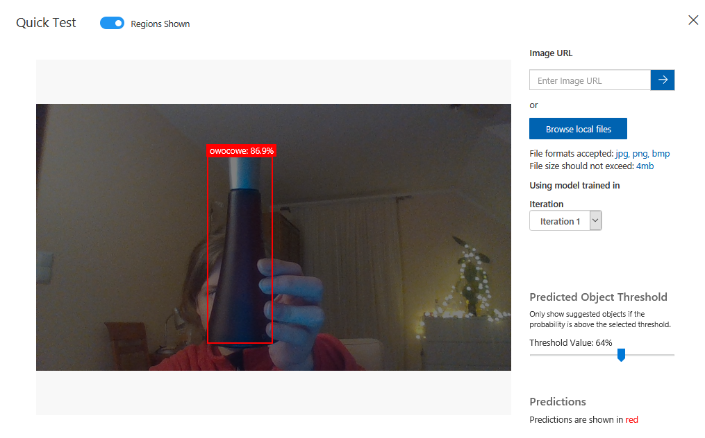
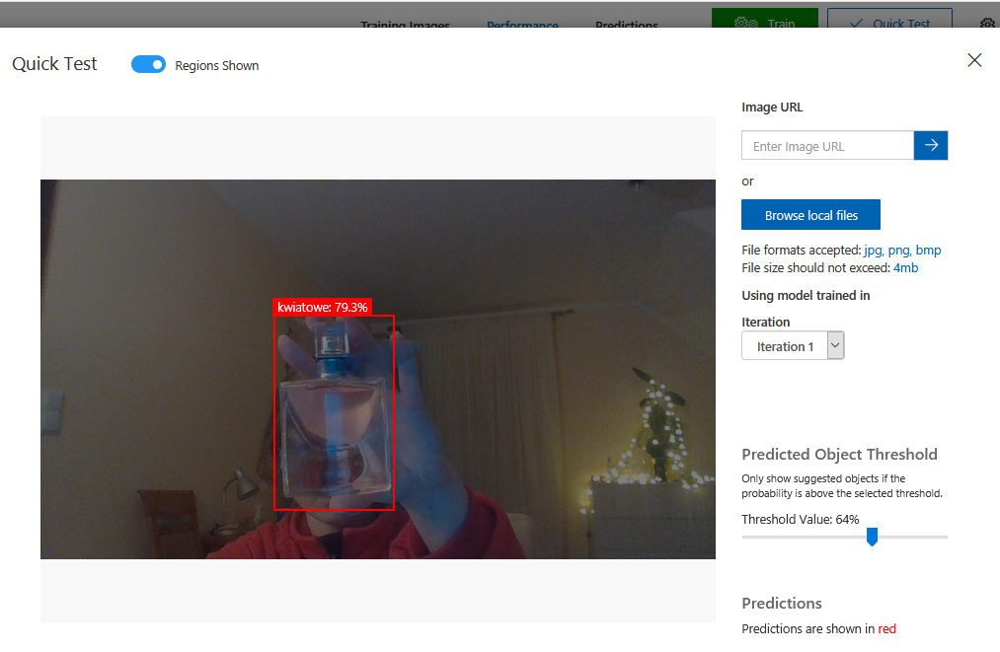
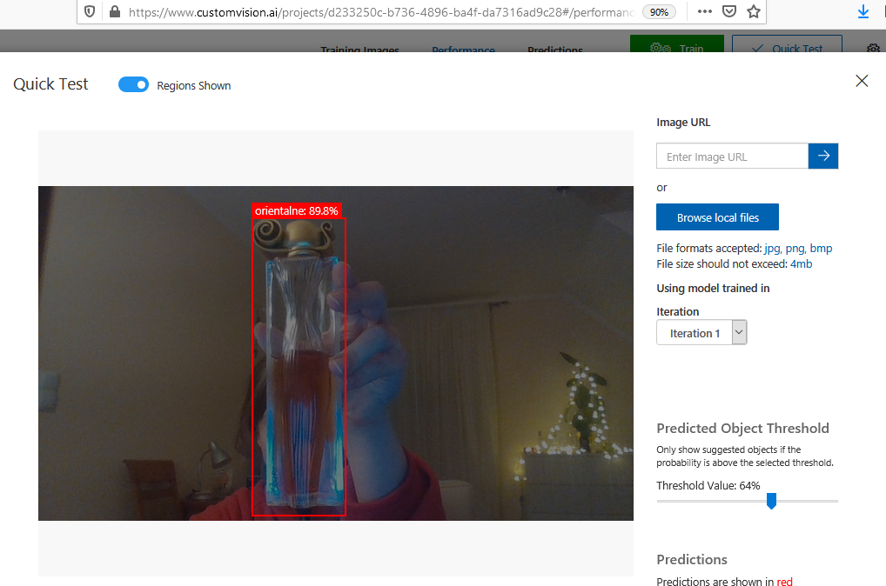
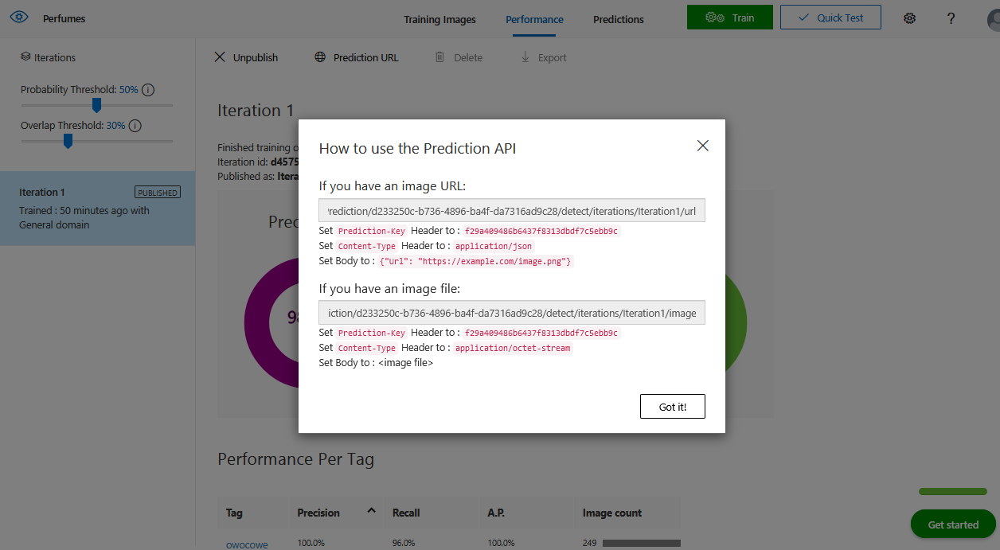

## Detekcja perfum na zdjęciach z informacją o kategorii zapachu, wykorzystanie Custom Vision

### Use case
Celem tego projektu jest zbudowanie detektora perfum i określanie ich kategorii zapachowej. Moja wersja projektu pozwala na wykrycie trzech perfum i wskazanie ich ogólnje nuty zapachowej.
Oczywiście projekt można dalej rozwijać, tworząc dużo większy zbiór danych, w którym znajdzie się więcej perfum i kategorii zapachowych.
Obecnie coraz więcej kupujemy przez Internet, zbliżają się również święta, częstym wyborem na prezent są perfumy. Chcąc zrobić drugiej osobie niespodziankę można sprawdzić jakie perfumy posiada już w swojej kolekcji i na tej podstawie kupić z podobnej grupy zapachowej. Znacznie ułątwi to wybór prezentu. Z własnego doświadczenia wiem, że łatwo się pomylić, a szukając w Internecie informacji o grupach zapachowych można stracić dużo czasu, bo zazwyczaj podawane są nuty głowy serca i bazy. 
Przygotowałam samodzielnie zbiór trenujący. Wykonałam zdjęcia telefonem komórkowych oraz kilkanaście pobrałam z Internetu.
Zadbałam o różnorodność zbioru zdjęć (zdjęcia robione pod różnym kątem, z innym oświetleniem i innym tłem oraz umiejscowieniem przedmiotów).
Posiłkując się kategoriami niektórych z drogerii skategoryzowałam moje dane w trzy kategorie: orientalna, owocowa i kwiatowa.

Pierwotnym pomysłem było stworzenie klasyfikatora, który wykrywa nam podrobione fiolki perfum i oryginalne. Niestety nie udało mi się zdobyć odpowiedniego zbioru danych trenujących.

Zadanie, którego się podjęłam możnaby wykonać również na podstawie klasyfikacji, dostarczyć mnóstwo zdjęć i podawać kategorie zapachowe. 

W moim przypadku do jednej kategorii należały jedne perfumy, aby rozpoznawać więcej perfum należących do tej samej kategorii zapachowej łatwiej do nauczenia modelu byłoby zastosować więcej tagów (np. składających się z nazwy z przypisaną kategorią zapachową).

### Kroki budowy rozwiązania
Na stronie https://www.customvision.ai/ utworzyłam nowy projekt "Perfumes", ale najpierw:
1. Resource Group "CustomVisionPerfumes"
2. Resource "CustomVisionPerfumes_r".
 
Następnie dodałam zdjęcia treningowe. Zbiór zawierał 576 obrazów. Na zdjęciach znajdowało się kilka flakonów perfum, jeden albo wcale.
Stworzyłam trzy tagi: orientalne, kwiatowe, owocowe. Wszystkie zdjęcia później otagowałam. Było to zadanie długotrwałe.
 
Następnie wyktrnowałam model (szybkie trenowanie), dobierając wartość precision na 70% i progu na 30%.
Uzyskałam wynik poniżej:
 
Później szybko przetestowałam każdą kategorię, dodając zdjęcia, które nie były użyte w trenowaniu. Wyniki, na 3 poniższych zdjęciach:
 
 
 
Uważam, że model radzi sobie bardzo dobrze z wykrywaniem perfum.
Opublikowałam go i pobrałam url predykcyjne.
 
Projekt można dalej rozszerzać i użyć w Azure Cloud Shell lub też użyć lokalnie, np. pisząc kod w Pythonie.
Azure Cloud Shell jest płatne, a ja wolę zostawić pieniądze na projekt.

Część danych trenujących została umieszczona w folderze Images/Vision. Aby, uzyskać wszystkie dane trenujące należy napisać do mnie e-mail (286466@pw.edu.pl).

    
